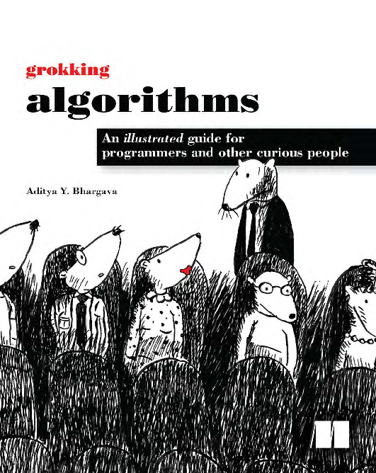

# DATA STRUCTURES AND ALGORITHMS IN JAVA
This repository is dedicated to my introductory studies and practical explorations in **Data Structures and Algorithms (DSA)** using **Java**. It serves as both a personal learning journal and a public resource for anyone interested in mastering algorithmic problem-solving in Java.

---

## 📖 Reference Textbook

This classic book forms the theoretical foundation for most of the implementations and exercises in this repository.

---

## 🧠 Study Focus

The repository covers a structured progression through fundamental and advanced DSA topics, including:

- **Introduction to Algorithms**
- **Selection Sort**
- **Recursion**
- **Quick Sort**
- **Hash Tables**
- **Breadth-First Search**
- **Dijkstra’s Algorithm**
- **Sorting Algorithms**
- **Greedy Algorithms**
- **K-Nearest Neighbours**
- **Where to Go Next**
- **Exercises**

Each topic includes:
- Java source code implementations (`.java` files)
- Inline comments and explanations
- Occasional notes, exercises, or complexity analysis

The book uses the Python Programming Language for its demonstrations. However, as a Java Developer, I follow the lessons with Java and ocassionally resort to [Grok](https://grok.com/) AI chatbot for demonstrations of implementations that may be challenging to do.

---

## 💻 Development Environment

- **Programming Language:** Java  
- **IDE / Editor:** [Eclipse IDE](https://eclipseide.org/)  
- **Version Control:** Git
- **Repository Hosting:** GitHub  

All code is written and managed using Eclipse, with Git for version control and synchronization.

---

## 🚀 Goals

- Strengthen theoretical understanding of data structures and algorithms.  
- Build efficient and reusable Java implementations.  
- Apply algorithmic reasoning to real-world computational problems.  
- Contribute clean, well-documented examples for learners and developers.

---

## 🤝 Contributions

This repository is primarily for **personal academic study**, but:
- Feedback, suggestions, and discussions are welcome.  
- You may fork the repository for your own learning.  
- Please provide credit if referencing or adapting any code from here.

---

## 📬 Connect

If you find this repository helpful or want to collaborate on DSA or Java-related topics, feel free to:

- ⭐ Star this repository  
- 📧 Reach out via [GitHub profile](https://github.com/Ashdof)

---

> _“Programs must be written for people to read, and only incidentally for machines to execute.”_  
> — **Harold Abelson**

